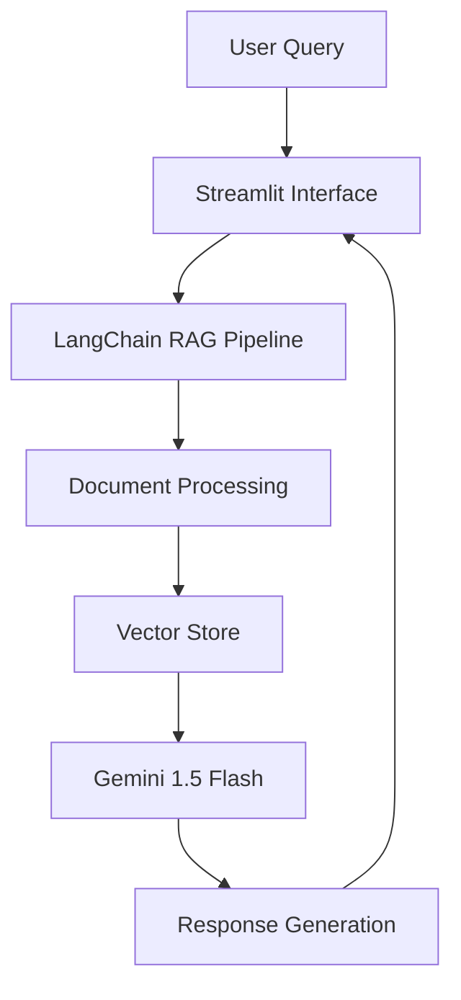
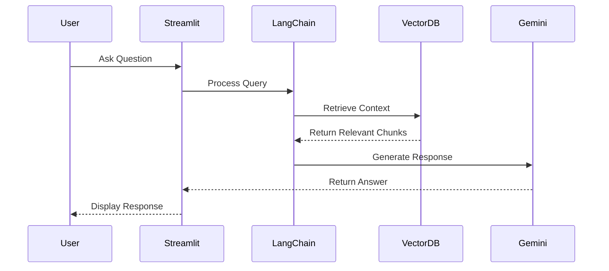
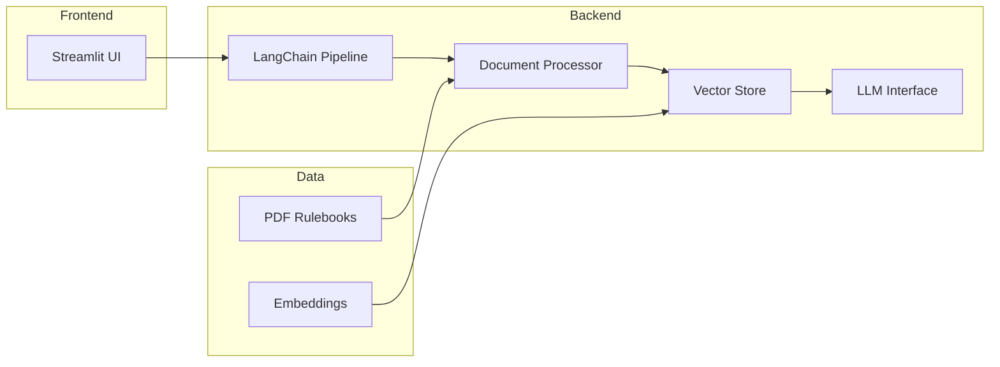

# Board Games FAQ

[](https://colab.research.google.com/drive/1ofRC5td5rYFlonUKfXhbWmAFJu4RLIR8?usp=sharing)

## Project Summary
Board Games FAQ is an intelligent chatbot that transforms static board game rulebooks into an interactive knowledge base using Google's Gemini 1.5 Flash and LangChain's RAG capabilities. This project demonstrates how to build a production-ready AI application that makes board games more accessible and enjoyable for players of all experience levels.

#AI #BoardGames #LangChain #RAG

## 🎯 What & Why

### Problem Statement
Board game rulebooks can be complex and time-consuming to navigate, often leading to:
- Gameplay interruptions while searching for specific rules
- Disputes over rule interpretations
- Difficulty for new players to get started
- Time wasted flipping through pages

### Solution
Our AI-powered chatbot provides:
- Instant, accurate answers to game-related questions
- Natural language understanding of complex rule queries
- Support for multiple popular board games
- Easy-to-use interface accessible via web or Colab

## 🛠️ How It Works

### Architecture Overview



### Technical Implementation



## 🎮 Features

### Core Capabilities
- **Multi-Game Support**
  - Catan (Base + 5-6 Player Expansion)
  - Codenames
  - Pandemic
  - Monopoly
  - Ticket to Ride (Base + Expansions)

- **Advanced NLP Features**
  - Natural language understanding
  - Context-aware responses
  - Rule clarification
  - Game mechanics explanation

### Technical Features
- **RAG Implementation**
  - Document chunking
  - Vector embeddings
  - Semantic search
  - Context retrieval

- **Modern Tech Stack**
  - Google Gemini 1.5 Flash
  - LangChain framework
  - Streamlit interface
  - Chroma vector database

## 📊 System Architecture



## 🚀 Getting Started

### Prerequisites
- Python 3.8+
- Google API Key for Gemini
- Required Python packages (see requirements.txt)

### Installation
1. Clone the repository
```bash
git clone https://github.com/yourusername/board-games-faq.git
cd board-games-faq
```

2. Install dependencies
```bash
pip install -r requirements.txt
```

3. Set up environment variables
```bash
export GEMINI_API_KEY='your-api-key'
```

4. Run the application
```bash
streamlit run app.py
```

## 📈 Future Improvements

### Planned Features
1. **Enhanced User Experience**
   - Interactive game selection
   - Visual rule explanations
   - Game strategy suggestions

2. **Technical Enhancements**
   - Multi-format support (TXT, DOCX)
   - Advanced NLP features
   - Improved response accuracy
   - Caching system

3. **Deployment & Scaling**
   - Cloud deployment
   - Load balancing
   - Performance optimization

## 📚 Learnings & Best Practices

### Key Takeaways
1. **RAG Implementation**
   - Optimal chunk size selection
   - Context window management
   - Query optimization

2. **LLM Integration**
   - Prompt engineering
   - Response formatting
   - Error handling

3. **System Design**
   - Modular architecture
   - Scalable components
   - Performance considerations

## 🤝 Contributing

I welcome contributions!

## 📄 License

This project is licensed under the MIT License.

## 🙏 Acknowledgments

- Google Gemini team for the powerful LLM
- LangChain team for the excellent framework
- Streamlit for the web interface
- All contributors and users of the project
